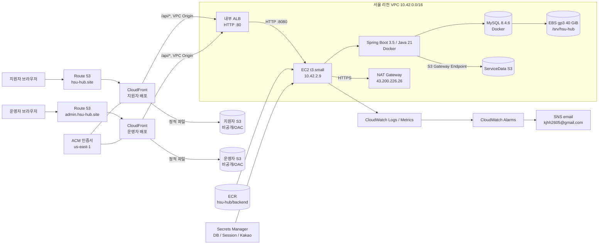
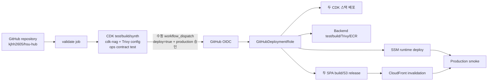

# HSU Hub 운영 인프라 아키텍처

> 기준 시각: 2026-08-18 KST  
> 대상 환경: `production`  
> AWS 계정: `004376454721`  
> 주 리전: `ap-northeast-2` (서울), CloudFront 인증서 리전: `us-east-1` (버지니아 북부)  
> 운영 도메인: `hsu-hub.site`, `admin.hsu-hub.site`

이 문서는 저장소의 CDK, 배포 스크립트, GitHub Actions, 백엔드 설정과 실제 배포된 AWS 리소스를 2026-08-18에 대조하여 작성한 운영 인프라 기준 문서다. 비밀 값은 기록하지 않으며, 리소스 ARN·ID처럼 비밀이 아닌 운영 식별자는 장애 대응과 추적을 위해 기재한다.

## 1. 전체 구성 요약

HSU Hub는 두 개의 정적 SPA와 하나의 Spring Boot API를 제공한다. 정적 파일은 비공개 S3에서 CloudFront OAC로 전달되고, `/api/*` 요청만 CloudFront VPC Origin을 통해 내부 ALB와 단일 EC2 인스턴스로 전달된다. EC2에는 백엔드와 MySQL이 Docker Compose로 함께 실행되며, MySQL 데이터는 별도의 보존형 EBS 볼륨에 저장된다.



핵심 특성은 다음과 같다.

- 인터넷에 직접 노출되는 계층은 Route 53과 CloudFront뿐이다.
- S3 버킷은 모두 퍼블릭 액세스가 차단되어 있고, 프론트엔드는 CloudFront OAC로만 읽는다.
- ALB는 `internal`이며 CloudFront VPC Origin을 통해서만 접근한다.
- EC2는 퍼블릭 IP가 없고 SSH 포트도 없다. 운영 접근과 배포는 AWS Systems Manager를 사용한다.
- 애플리케이션과 MySQL은 단일 EC2에서 실행된다. Multi-AZ 애플리케이션/DB 구성은 아니다.
- SES나 이메일 로그인 인프라는 없다. 로그인은 Kakao OAuth만 사용하며, 이메일은 SNS 운영 알림 수신에만 쓰인다.

## 2. 관리 경계와 CloudFormation 스택

인프라는 AWS CDK TypeScript로 선언한다. CDK 라이브러리는 `aws-cdk-lib 2.265.0`, 저장소의 CDK CLI는 `2.1136.0`이며 CI는 Node.js 22를 사용한다.

| 스택 | 리전 | 상태 | 종료 방지 | 책임 |
|---|---|---|---|---|
| `HsuHubDnsCertificate` | `us-east-1` | `CREATE_COMPLETE` | 활성 | Route 53 Hosted Zone, ACM 인증서, 교차 리전 값 전달 |
| `HsuHubPlatform` | `ap-northeast-2` | `UPDATE_COMPLETE` | 활성 | 네트워크, 컴퓨팅, 스토리지, CDN, IAM, 관측성, DNS 레코드 |

두 스택에는 `Application=hsu-hub`, `Environment=production`, `ManagedBy=aws-cdk` 태그가 적용된다. Hosted Zone, 인증서, KMS 키, 로그 그룹, ECR, S3와 데이터 EBS 등 데이터 보존이 필요한 자원은 삭제 정책이 `RETAIN`이다.

CDK 컨텍스트로 다음 값을 반드시 받는다.

| 키 | 현재 값/의미 |
|---|---|
| `account` | `004376454721` |
| `region` | `ap-northeast-2`; 코드에서 이 리전만 허용 |
| `domainName` | `hsu-hub.site` |
| `githubRepository` | `kjhh2605/hsu-hub` |
| `githubEnvironment` | `production` |
| `operationsPrincipalArn` | `arn:aws:iam::004376454721:role/HsuHubOperators` |
| `alertEmail` | `kjhh2605@gmail.com` |
| `kakaoSecretArn` | `/hsu-hub/production/kakao-qT641c`의 전체 ARN |

리전 간 강한 참조를 위해 CDK custom resource가 생성된다. DNS 스택에는 cross-region export writer Lambda/역할이 있고, 플랫폼 스택에는 cross-region export reader, GitHub OIDC provider, 기본 보안 그룹 제한을 위한 provider Lambda/역할이 각각 있다. 이 세 종류의 Lambda는 애플리케이션 요청을 처리하는 함수가 아니라 CloudFormation 배포 보조 리소스다.

## 3. DNS와 TLS

### 3.1 Route 53

- Public Hosted Zone ID: `Z06282063MT1D4CZ77KKA`
- Name servers:
  - `ns-219.awsdns-27.com`
  - `ns-1755.awsdns-27.co.uk`
  - `ns-1070.awsdns-05.org`
  - `ns-1021.awsdns-63.net`
- `hsu-hub.site`: 지원자 CloudFront 배포를 향하는 A/AAAA Alias
- `admin.hsu-hub.site`: 운영자 CloudFront 배포를 향하는 A/AAAA Alias

외부 도메인 등록기관에는 위 네 개 NS를 위임해야 한다. 애플리케이션 서브도메인에 별도 CNAME을 두는 방식이 아니라 Route 53 Alias 레코드를 CDK가 관리한다.

### 3.2 ACM

- 인증서 ARN: `arn:aws:acm:us-east-1:004376454721:certificate/5b5598ee-8668-4bb0-9c31-e3f9cea2731f`
- 인증서 리전: CloudFront 요구사항에 따라 `us-east-1`
- 대상 이름: 루트 도메인과 `admin` 서브도메인
- 검증: Route 53 DNS 검증
- CloudFront 최소 TLS 버전: `TLSv1.2_2021`
- SSL 방식: SNI only

## 4. 요청 경로

### 4.1 지원자 웹

1. 브라우저가 `hsu-hub.site`를 조회하면 Route 53이 지원자 CloudFront로 연결한다.
2. `/api/*`가 아닌 요청은 지원자 S3 버킷에서 OAC 서명 요청으로 읽는다.
3. 확장자가 없고 `/api/`로 시작하지 않는 경로는 CloudFront Function이 `/index.html`로 바꿔 SPA 라우팅을 유지한다.
4. `/api/*`는 캐시하지 않고 지원자용 VPC Origin을 거쳐 내부 ALB로 전달한다.
5. CloudFront가 원본 요청에 `X-HSU-Frontend: applicant`를 추가하고, 백엔드는 이를 Kakao callback origin 선택에 사용한다.

### 4.2 운영자 웹

운영자 경로는 `admin.hsu-hub.site`와 별도 S3/CloudFront 배포를 사용한다. API 경로에는 `X-HSU-Frontend: admin`이 추가된다. 두 프론트엔드는 동일한 내부 ALB와 백엔드를 공유한다.

### 4.3 CloudFront 공통 정책

| 항목 | 구현값 |
|---|---|
| HTTP | HTTP/2 및 HTTP/3, IPv6 활성 |
| 가격 등급 | `PriceClass_200` |
| 기본 객체 | `index.html` |
| Viewer 정책 | HTTP를 HTTPS로 리다이렉트 |
| 정적 캐시 | AWS managed `CachingOptimized` |
| 정적 메서드 | GET, HEAD, OPTIONS |
| API 캐시 | AWS managed `CachingDisabled` |
| API 메서드 | GET, HEAD, OPTIONS, POST, PUT, PATCH, DELETE |
| API 전달 쿠키/쿼리 | 모두 전달 |
| API 전달 헤더 | `Accept`, `Content-Type`, `Origin`, `Referer`, `X-XSRF-TOKEN`, `X-Request-Id`, `CloudFront-Viewer-Address` |
| 원본 읽기/keep-alive | 60초 / 5초 |
| 지역 제한 | 없음 |
| WAF | 없음 |

보안 헤더 정책은 HSTS 365일(`includeSubDomains`, preload), `X-Frame-Options: SAMEORIGIN`, `X-Content-Type-Options`, `Referrer-Policy: no-referrer`, XSS protection과 카메라·마이크·위치정보를 막는 `Permissions-Policy`를 설정한다. 정적 콘텐츠 CSP는 `default-src 'self'`를 기준으로 이미지의 `data:`/`blob:`, 필요한 API·스타일·폰트 연결만 허용한다. 백엔드 응답도 별도의 Spring Security 헤더 정책을 적용한다.

CloudFront 및 ALB 액세스 로그는 OAuth `code`와 `state`가 쿼리 문자열에 남는 위험을 피하기 위해 의도적으로 비활성화했다. 정적 S3 서버 액세스 로그는 ServiceData 버킷에 보관한다.

### 4.4 실제 CloudFront 리소스

| 용도 | Distribution ID | CloudFront 도메인 | VPC Origin | S3 OAC |
|---|---|---|---|---|
| 지원자 | `E1TW7YTNJNM590` | `d26xzapsfcjmll.cloudfront.net` | `vo_JY9pwWb6jYgB3fzL56Venj` | `E3BGFTST7BYKJ6` |
| 운영자 | `E1L7PGDK1AJGCQ` | `d2j27l89ntb3v9.cloudfront.net` | `vo_F3Zoq11zC0gE3gdbIYOwEB` | `E58LFAIBW57AC` |

두 배포 모두 현재 `Deployed`, `Enabled` 상태다.

## 5. 네트워크

### 5.1 VPC와 서브넷

- VPC ID: `vpc-00b2ef69b4833b82c`
- CIDR: `10.42.0.0/16`
- 가용 영역: `ap-northeast-2a`, `ap-northeast-2c`
- DNS support/hostnames: CDK VPC 기본값으로 활성
- 기본 보안 그룹: ingress/egress를 제거하는 custom resource로 제한
- VPC Flow Log: 거부(`REJECT`) 트래픽만 CloudWatch Logs로 전송

| 유형 | AZ | CIDR | Subnet ID | 기본 경로 |
|---|---|---|---|---|
| Public | `2a` | `10.42.0.0/24` | `subnet-0059c39731a5576e2` | Internet Gateway |
| Public | `2c` | `10.42.1.0/24` | `subnet-0f720c83fb6fdb63a` | Internet Gateway |
| Application private | `2a` | `10.42.2.0/24` | `subnet-04b2acc5dcde7468b` | 단일 NAT Gateway + S3 endpoint |
| Application private | `2c` | `10.42.3.0/24` | `subnet-0a3c0142fda2d18af` | 단일 NAT Gateway + S3 endpoint |

서브넷은 모두 `MapPublicIpOnLaunch=false`다. Public 서브넷은 인터넷 경로를 갖지만 인스턴스에 자동 퍼블릭 IP를 부여하지 않는다.

### 5.2 인터넷 송신

- NAT Gateway: `nat-085d...` (Public `2a` 서브넷)
- Elastic IP: `43.200.226.26`
- NAT 사설 IP: `10.42.0.15`
- 두 private 서브넷이 하나의 NAT를 공유하므로 NAT와 해당 AZ 장애에 대한 다중 AZ 송신 이중화는 없다.

EC2의 일반 HTTPS 송신은 NAT를 통해 ECR API, Secrets Manager, Kakao API 등에 접근한다. DNS는 VPC resolver `10.42.0.2`, 시간 동기화는 Amazon Time Sync `169.254.169.123`을 사용한다.

### 5.3 S3 Gateway Endpoint

- Endpoint ID: `vpce-07cf76760c0905844`
- 서비스: `com.amazonaws.ap-northeast-2.s3`
- 상태/유형: `available` / Gateway
- 연결: 두 Application private route table
- 허용 대상:
  - InstanceRole과 BackupRole의 ServiceData 버킷 객체 작업
  - ECR layer용 `prod-ap-northeast-2-starport-layer-bucket`
  - Amazon Linux 2023 저장소 버킷

ServiceData의 업로드/백업 객체에는 버킷 정책으로 이 endpoint 사용을 강제한다. 현재 endpoint 정책과 BackupRole assumed session 간에는 아래 `알려진 운영 제약`에 기록한 실제 업로드 문제가 있다.

### 5.4 보안 그룹

| 보안 그룹 | Ingress | Egress |
|---|---|---|
| ALB `sg-07f...` | AWS CloudFront origin-facing managed prefix list에서 TCP 80 | Instance SG로 TCP 8080만 |
| Instance `sg-04ab7b821dc0a797b` | ALB SG에서 TCP 8080만 | 인터넷 TCP 443, `10.42.0.2/32` TCP/UDP 53, `169.254.169.123/32` UDP 123 |

SSH(22), MySQL(3306), 애플리케이션(8080)의 인터넷 직접 ingress는 없다. MySQL은 호스트 포트도 publish하지 않는다.

## 6. 로드 밸런서

- 종류: Application Load Balancer
- Scheme: `internal`
- 주소 유형: IPv4
- 배치: 두 Application private 서브넷
- Listener: HTTP 80
- Target: EC2 `i-027f6dc0f6686ea09`, HTTP 8080
- 현재 target health: `healthy`
- 삭제 방지: 활성
- 잘못된 HTTP 헤더 제거: 활성
- ALB access log: 비활성

Target Group health check는 `/actuator/health`, interval 30초, timeout 5초, healthy threshold 5, unhealthy threshold 2, 성공 코드 200을 사용한다. deregistration delay는 60초다. TLS는 CloudFront에서 종료되고 CloudFront VPC Origin에서 내부 ALB까지는 VPC 내부 HTTP다.

## 7. EC2와 운영체제

| 항목 | 실제 값 |
|---|---|
| Instance ID | `i-027f6dc0f6686ea09` |
| 상태 | `running` |
| 타입/아키텍처 | `t3.small`, x86_64 |
| OS | Amazon Linux 2023 |
| AMI | `ami-0729121845edb4108` |
| 사설 IP | `10.42.2.9` |
| 퍼블릭 IP | 없음 |
| 배치 서브넷 | Application `2a` (`subnet-04b2acc5dcde7468b`) |
| 상세 모니터링 | 활성 |
| API termination protection | 활성 |
| SSM | Online, SSM Agent `3.3.4624.0` 확인 |

IMDSv2 토큰은 필수이고 hop limit는 컨테이너 자격증명 사용을 위해 2다. 인스턴스 metadata tag 노출과 metadata IPv6는 비활성화되어 있다.

### 7.1 EBS

| 장치 | 크기/유형 | 암호화 | 종료 시 삭제 | 용도 |
|---|---|---|---|---|
| Root `/dev/xvda` | 20 GiB gp3 | 계정 기본 EBS KMS | 예 | OS, Docker, 실행 파일 |
| Data `/dev/xvdb` → NVMe | 40 GiB gp3 | 계정 기본 EBS KMS | 아니오 | XFS `/srv/hsu-hub`, MySQL 데이터 |

실측 데이터 볼륨은 `/dev/nvme1n1`, XFS 40GiB로 `/srv/hsu-hub`에 마운트되어 있고 문서 작성 시점 사용률은 약 2%다. CDK의 `alias/hsu-hub-data` KMS 키는 Secrets/ECR/CloudWatch Logs에 사용하며 EBS는 계정 기본 EBS 암호화 키를 사용한다.

### 7.2 부트스트랩

UserData가 다음 작업을 담당한다.

- Docker, AWS CLI/SSM 연동 도구, CloudWatch Agent, `jq` 설치
- Docker와 SSM 서비스 활성화
- 보존형 데이터 디스크를 최초 1회 XFS 포맷하고 `/srv/hsu-hub`에 영구 마운트
- `/opt/hsu-hub`, `/opt/hsu-hub/logs`, `/srv/hsu-hub/mysql` 권한 구성
- CloudWatch Agent에 메모리·디스크 메트릭과 애플리케이션/cloud-init 로그 수집 설정

최초 생성 당시 제한된 S3 endpoint 정책 때문에 일부 bootstrap을 수동 재실행했지만, 현재 Docker/SSM/CloudWatch Agent와 데이터 마운트는 구성된 상태다.

## 8. 컨테이너 런타임

Docker Compose project 이름은 `hsu-hub`다. 실제 실행 상태는 다음과 같다.

| 서비스 | 이미지 | 상태/노출 |
|---|---|---|
| `hsu-hub-backend-1` | ECR `manual-184f48f-20260818-1506` | 실행 중, 호스트 8080 → 컨테이너 8080 |
| `hsu-hub-db-1` | `mysql:8.4.6` | 실행 중/healthy, 호스트 포트 없음 |

### 8.1 백엔드 컨테이너

- Java 21 Alpine 기반 Spring Boot 이미지
- 컨테이너 사용자 `10001:10001`
- read-only root filesystem
- Linux capability 전체 제거
- `no-new-privileges`
- `/tmp`만 128MiB tmpfs로 쓰기 허용
- 애플리케이션 로그는 `/opt/hsu-hub/logs` bind mount에 기록
- `application` 내부망과 `egress` bridge 모두 연결
- 재시작 정책 `unless-stopped`

Dockerfile 빌드 중 Alpine 패키지를 upgrade하고 Gradle로 애플리케이션을 빌드한다. 운영 profile은 `prod`, JPA DDL은 `validate`, Flyway는 활성, Hikari 최대 pool은 8이다.

### 8.2 MySQL 컨테이너

- 이미지 `mysql:8.4.6`
- 데이터베이스 `hsuhub`
- `utf8mb4` / `utf8mb4_0900_ai_ci`
- UTC, `skip-name-resolve`
- capability는 모두 제거한 뒤 MySQL 실행에 필요한 `CHOWN`, `DAC_OVERRIDE`, `FOWNER`, `SETGID`, `SETUID`만 추가
- `no-new-privileges`
- `application` 내부 Docker network에만 연결
- `/srv/hsu-hub/mysql`을 `/var/lib/mysql`로 bind mount
- `mysqladmin ping` health check: 10초 간격, timeout 5초, 12회 재시도, start period 30초

### 8.3 Docker network의 의미

`application` network는 `internal: true`라서 백엔드와 DB의 내부 통신 전용이다. 백엔드는 Kakao, AWS API 등에 접근해야 하므로 별도의 `egress` bridge에도 연결된다. DB는 egress network에 연결되지 않는다.

## 9. 애플리케이션 보안과 인증 경계

운영 인증은 Kakao OAuth다. 과거 이메일 인증/비밀번호 재설정 테이블은 Flyway V5에서 제거되었으며 SES, SMTP, 이메일 로그인 컴포넌트는 현재 인프라에 없다.

### 9.1 세션과 OAuth

- 세션: 서버 저장형 opaque session, 쿠키 `__Host-HSU_SESSION`
- 세션 쿠키: `Secure`, `HttpOnly`, `SameSite=Lax`, `Path=/`, 7일
- OAuth state 쿠키: `__Host-HSU_OAUTH`, 같은 보안 속성, 5분
- CSRF: 읽기 가능한 `__Host-XSRF-TOKEN` cookie와 `X-XSRF-TOKEN` header 조합
- Spring Security session policy: stateless
- CORS origin: `https://hsu-hub.site`, `https://admin.hsu-hub.site`만 허용, credentials 허용
- OAuth start rate limit: IP별 10분에 20회
- OAuth callback rate limit: IP별 10분에 30회

`X-HSU-Frontend`는 사용자가 직접 신뢰 경계를 선택하는 헤더가 아니라 CloudFront가 각 VPC Origin에 넣는 custom origin header다. `applicant`와 `admin`만 허용하며, 값에 따라 Kakao callback 및 최종 redirect origin을 고른다. 클라이언트 IP는 CloudFront가 전달한 `CloudFront-Viewer-Address`를 엄격히 파싱하고 실패하면 원격 주소를 사용한다.

`/actuator/health`, OpenAPI/Swagger, Kakao start/callback GET만 익명 허용이고 그 외 API는 인증이 필요하다. 변경 요청에는 CSRF 검증이 적용된다. Swagger가 익명 경로라는 점은 운영 노출 정책상 인지해야 한다.

## 10. 데이터베이스 스키마와 현재 데이터 상태

Flyway migration은 V1부터 V5까지 적용된다. 현재 물리 DB에는 애플리케이션 테이블 16개와 `flyway_schema_history`가 있다.

```text
users, user_sessions
clubs, club_users
recruitments, recruitment_stages
application_forms, form_steps, form_questions, question_options
applications, application_answers, resume_submissions, application_idempotency
file_assets, file_cleanup_tasks
flyway_schema_history
```

- V1: 기본 사용자·동아리·모집·지원서·파일 스키마 생성
- V2: 5개 동아리 초기 데이터 삽입
- V3: `file_cleanup_tasks` 추가
- V4: hash column 길이를 64자로 정렬
- V5: 빈 사용자 테이블을 전제로 이메일 인증 테이블/비밀번호 column을 제거하고 `kakao_user_id` unique key로 전환

2026-08-18 실측 count는 `clubs=5`, `users=1`, `user_sessions=2`다. 앞선 목 데이터 삭제 시도는 삭제 0건으로 끝났고 관련 코드/인프라 변경은 롤백되었으므로, 이 count는 삭제 작업 전후 동일하다. 다만 V2의 5개 동아리 seed는 migration의 일부이므로 빈 DB를 새로 만들면 다시 삽입된다.

## 11. S3 저장소

모든 버킷은 versioning, SSE-S3(`AES256`), SSL-only, Block Public Access 전체 옵션이 활성이고 removal policy는 `RETAIN`이다.

| 용도 | 실제 버킷 | 접근 방식 |
|---|---|---|
| 지원자 SPA | `hsuhubplatform-applicantartifacts4e5462b1-92hve48mqmtx` | 지원자 CloudFront OAC 및 배포 역할 |
| 운영자 SPA | `hsuhubplatform-adminartifacts48321cff-chmmiubixfjw` | 운영자 CloudFront OAC 및 배포 역할 |
| 업로드/백업/로그 | `hsuhubplatform-servicedata8376727a-qu6fyngbebf8` | Instance/Backup/Restore 역할과 S3 endpoint |

지원자/운영자 버킷의 S3 server access log는 각각 아래 prefix에 쌓인다.

- `access-logs/s3/applicant/`
- `access-logs/s3/admin/`

ServiceData lifecycle은 다음과 같다.

| Prefix | 현재 버전 | 이전 버전 | 추가 규칙 |
|---|---:|---:|---|
| `uploads/tmp/` | 1일 후 만료 | - | 미완료 multipart upload 1일 후 중단 |
| `backups/` | 14일 후 만료 | 14일 후 만료 | 애플리케이션/API에 의한 직접 삭제는 거부 |
| `access-logs/` | 90일 후 만료 | 30일 후 만료 | - |

ServiceData bucket policy는 다음 경계를 강제한다.

- `uploads/*`: S3 endpoint를 통하고 InstanceRole principal이어야 한다.
- `backups/*` 쓰기: S3 endpoint를 통하고 BackupRole이어야 한다.
- `backups/*` 읽기: RestoreRole이어야 한다.
- `backups/*` 삭제: 모든 principal에 명시적 Deny.
- 지원자/운영자 버킷만 해당 source ARN과 계정 조건으로 로그를 쓸 수 있다.

## 12. ECR

- Repository: `004376454721.dkr.ecr.ap-northeast-2.amazonaws.com/hsu-hub/backend`
- Tag mutability: immutable
- Push scan: 활성
- 암호화: KMS `alias/hsu-hub-data`
- Lifecycle: 최신 20개 이미지 유지
- 삭제 정책: `RETAIN`
- 현재 실행 이미지 tag: `manual-184f48f-20260818-1506`
- 현재 digest: `sha256:57cc57707508a01d9aa2e37c40958fd0eedc6ebd4309a80d2d7ad4681e17b0e5`

정식 GitHub 배포는 `sha-${GITHUB_SHA}` tag를 사용한다. 현재 `manual-*` tag는 초기/수동 운영 배포로 생성된 것이다.

## 13. Secrets Manager와 KMS

### 13.1 비밀

| 비밀 | 실제 식별자 | 형식/사용 |
|---|---|---|
| DB | `/hsu-hub/production/database-9FMSXN` | JSON `username=hsuhub`, 생성된 32자 password |
| Session | `/hsu-hub/production/session-4oRSZa` | 생성된 64자 session signing secret |
| Kakao | `/hsu-hub/production/kakao-qT641c` | 기존 secret import, JSON `clientId`, `clientSecret` |

비밀 값은 CDK template, GitHub Actions, 이 문서에 저장하지 않는다. EC2가 배포 시 Secrets Manager에서 읽어 root-only `/opt/hsu-hub/runtime.env`를 만든다. DB와 Session secret은 `RETAIN`이고 자동 rotation은 구성되어 있지 않다.

### 13.2 KMS

| Alias | Key ID | 용도 |
|---|---|---|
| `alias/hsu-hub-data` | `431a7cea-f0af-48ba-a98b-3f34b67eed9f` | Secrets Manager, ECR, CloudWatch Logs |
| `alias/hsu-hub-alarms` | `c58b72d6-5b57-4b30-9e26-d94e840be59f` | SNS alarm topic |

두 키 모두 rotation과 `RETAIN`이 활성이다. CloudWatch Logs의 data key 정책은 해당 계정의 Logs service 및 encryption context로 제한한다.

## 14. IAM과 접근 제어

### 14.1 InstanceRole

실제 역할: `arn:aws:iam::004376454721:role/HsuHubPlatform-InstanceRole3CCE2F1D-nRvGqlQ3qfca`

- 신뢰 principal: EC2
- SSM Session Manager/Run Command에 필요한 SSM core 권한
- ECR image pull
- DB/Session/Kakao secret 읽기 및 필요한 KMS decrypt
- 애플리케이션/시스템 CloudWatch Logs 쓰기
- ServiceData `uploads/*` 객체 작업
- BackupRole assume

### 14.2 BackupRole

- 역할: `HsuHubPlatform-BackupRoleF43CFD90-AXvjIVvOAL4t`
- 신뢰: InstanceRole
- 권한: `backups/*` Put 및 필요한 bucket list로 제한

### 14.3 RestoreRole

- 역할: `HsuHubPlatform-RestoreRole76935C4A-iaI67SGIaTRF`
- 신뢰: `HsuHubOperators`
- 권한: `backups/*` Get 및 필요한 bucket list로 제한

백업 생성 역할과 복구 읽기 역할을 분리해 런타임 인스턴스가 기존 백업을 읽지 못하도록 설계했다.

### 14.4 GitHubDeploymentRole

- 역할 ARN: `arn:aws:iam::004376454721:role/HsuHubPlatform-GitHubDeploymentRoleD4E2A70A-pSwrUppNjsLH`
- 신뢰: GitHub OIDC provider `token.actions.githubusercontent.com`
- audience: `sts.amazonaws.com`
- subject: `repo:kjhh2605/hsu-hub:environment:production`과 정확히 일치해야 함
- 장기 AWS access key 사용 없음
- 권한: 두 리전 CDK bootstrap role assume, ECR push, frontend S3 publish, CloudFront invalidation, 대상 EC2 SSM command, 필요한 CloudFormation/CloudFront describe

### 14.5 Operations principal

기존 `HsuHubOperators` 역할에 CDK managed policy를 연결한다.

- 해당 EC2에 대한 SSM session 및 command
- RestoreRole assume
- ECR/CloudFront 조회
- 프론트엔드 S3 publish와 두 배포 invalidation

EC2에 대한 SSH key pair나 bastion host는 사용하지 않는다.

## 15. 로그, 메트릭, 알람

### 15.1 CloudWatch Logs

| Log Group | 보존 | 암호화 | 내용 |
|---|---:|---|---|
| `/hsu-hub/production/application` | 90일 | data KMS | `/opt/hsu-hub/logs/application.log` |
| `/hsu-hub/production/system` | 30일 | data KMS | `/var/log/cloud-init-output.log` |
| `HsuHubPlatform-VpcFlowLogsE6FFDEF9-ZjB6F9Qpr6hJ` | 30일 | data KMS | VPC REJECT flow |

로그 그룹은 모두 `RETAIN`이다. 애플리케이션 로그에는 request ID를 MDC에 넣어 `[requestId:...]` 형식으로 기록한다.

### 15.2 CloudWatch Agent

인스턴스에서 다음 사용자 메트릭을 발행한다.

- `CWAgent/mem_used_percent`
- `CWAgent/disk_used_percent` (`/srv/hsu-hub`)

EC2 상세 모니터링과 ALB 기본 메트릭을 함께 사용한다.

### 15.3 알람과 SNS

| 알람 | 조건 | 평가 | Missing data |
|---|---|---|---|
| Backend 5xx rate | 5% 초과 | 5분 × 2/2 | not breaching |
| EC2 CPU | 평균 80% 초과 | 5분 × 2/2 | breaching |
| EC2 status check | 최대값 0 초과 | 1분 × 2/2 | breaching |
| Unhealthy target | 최대값 0 초과 | 1분 × 2/2 | breaching |
| Memory | 평균 85% 초과 | 5분 × 2/2 | breaching |
| Data disk | 평균 80% 초과 | 5분 × 2/2 | breaching |

알람 topic은 `arn:aws:sns:ap-northeast-2:004376454721:HsuHubPlatform-AlarmTopicD01E77F9-wmgQAtMQRJLP`이며 `alias/hsu-hub-alarms`로 암호화된다. 이메일 subscription은 `kjhh2605@gmail.com`으로 확인 완료(`Confirmed`) 상태다. 이 이메일은 로그인 기능이 아니라 운영 장애 알림용이다.

## 16. CI/CD



Workflow 파일은 `.github/workflows/production.yml`이고 concurrency group은 `production`, `cancel-in-progress=false`다.

### 16.1 Trigger

- Pull request: `infrastructure/**`, `deploy/**`, `ops/**`, workflow 변경 시 validate
- `main` push: validate만 수행
- 실제 production deploy: `workflow_dispatch`에서 `deploy=true`일 때만 수행
- deploy job은 GitHub Environment `production`을 사용

### 16.2 Validate

1. `npm ci`
2. CDK unit test
3. TypeScript build
4. offline strict synth(`--lookups false`)와 `AwsSolutionsChecks` cdk-nag
5. digest로 고정한 Trivy 0.65.0 IaC scan, HIGH/CRITICAL에서 실패
6. `ops/test.sh`로 배포 계약 검사

IaC scan 예외는 `.trivyignore`에 명시된다. cdk-nag 예외도 코드에 사유와 함께 제한적으로 기록되어 있으며, 대표적으로 30명 규모 MVP에서 WAF 미사용, OAuth query 노출 방지를 위한 ALB/CloudFront access log 미사용, 단일 NAT/EC2 구조가 포함된다.

### 16.3 Deploy

1. GitHub OIDC로 AWS 역할 획득
2. 두 CDK 스택을 concurrency 1로 순차 배포
3. Gradle backend test
4. `sha-${github.sha}` tag로 Docker image build
5. Trivy image scan: HIGH/CRITICAL, unfixed 제외, timeout 20분
6. ECR push
7. 지원자 `mobile`, 운영자 `web` workspace build
8. SSM으로 EC2 runtime deploy
9. 각 S3의 `releases/<image-tag>/`에 버전 보관 후 bucket root로 sync
10. 두 CloudFront `/*` invalidation
11. production smoke test

현재 GitHub Actions repository variables에는 계정, 배포 역할, 운영 역할, Kakao secret ARN, `ALERT_EMAIL=kjhh2605@gmail.com`이 등록되어 있다. 비밀 값 자체는 repository variable에 두지 않는다.

## 17. 런타임 배포와 롤백

`ops/deploy.sh`가 SSM Run Command로 다음을 수행한다.

- Docker Compose `v5.5.0` x86_64 binary를 지정 SHA-256으로 검증 후 설치
- compose, runtime deploy, backup script와 systemd unit을 `/opt/hsu-hub`에 배치
- CloudFormation output으로 ECR, S3, secret, role 식별자를 작성
- 요청한 ECR tag로 `/opt/hsu-hub/runtime-deploy.sh` 실행

runtime deploy는 다음 안전장치를 갖는다.

- 요청 image가 지정 ECR repository에 속하는지 검증
- InstanceRole로 Secrets Manager에서 값을 가져와 mode 600 `runtime.env` 생성
- ECR 로그인, compose config 검증, pull, `up -d`
- 5초 간격 최대 36회 `/actuator/health` 확인
- 새 image가 실패하면 기존 `current-image`로 compose를 되돌림
- 성공 시 `current-image`/`previous-image` 추적
- 168시간보다 오래된 미사용 Docker image prune

별도 `ops/rollback.sh`는 `previous-image`를 배포한다. 프론트엔드 `ops/rollback-frontend.sh`는 S3의 `releases/<tag>/`를 root에 복사하고 CloudFront를 invalidate한다.

SSM command 기본 대기 제한은 600초다. SSM 명령은 SSH 없이 배포되지만 AWS 계정 내 command history에는 실행 이력이 남는다.

## 18. 백업과 복구

### 18.1 설계된 백업 흐름

1. `hsu-hub-backup.timer`가 매일 18:00 UTC(03:00 KST)에 실행된다.
2. 0~900초 random delay, `Persistent=true`로 중단 중 누락 실행을 보완한다.
3. InstanceRole이 BackupRole을 1시간 session으로 assume한다.
4. MySQL logical dump를 gzip으로 압축하고 `gzip -t`로 검증한다.
5. SHA-256 checksum을 만든다.
6. `backups/mysql/<UTC timestamp>.sql.gz`와 `.sha256`을 SSE-S3로 업로드한다.

systemd service는 root oneshot, `PrivateTmp`, `NoNewPrivileges`, 낮은 CPU/IO 우선순위를 사용한다. Timer는 현재 `enabled`, `active`다.

### 18.2 복구 훈련

`ops/restore-drill.sh`는 운영 DB를 덮어쓰지 않는다.

- OperationsRole이 RestoreRole을 assume
- 최신 또는 지정 backup/checksum 다운로드용 15분 presigned URL 생성
- URL을 base64로 SSM에 전달
- 임시 Docker volume과 `mysql:8.4.6` 컨테이너 생성
- checksum, gzip, import를 검증하고 애플리케이션 table count가 0보다 큰지 확인
- 임시 컨테이너, volume, archive 삭제

실제 운영 DB로의 자동 point-in-time restore, RDS snapshot, EBS snapshot 정책은 없다. 복구는 logical backup 기반 수동 절차다.

### 18.3 현재 확인된 백업 제약

현재 revision의 예약 백업은 **정상 동작한다고 간주하면 안 된다**. 2026-08-18 수동 검증에서 다음 두 문제가 확인됐고, 사용자의 요청에 따라 해당 수정 시도는 모두 롤백됐다.

1. `mysqldump`에 `--no-tablespaces`가 없어 MySQL application user로 실행 시 `PROCESS` 권한 오류가 발생한다.
2. dump 단계를 임시 우회한 검증에서는 현재 S3 Gateway Endpoint policy가 STS assumed BackupRole session의 업로드를 거부했다.

검증 과정에서 생성된 다음 객체 한 쌍은 ServiceData에 남아 있다.

- `backups/mysql/2026-08-18T07-25-01Z.sql.gz`
- `backups/mysql/2026-08-18T07-25-01Z.sql.gz.sha256`

`BackupDeletionDenied`와 versioning/lifecycle 정책을 약화하지 않기 위해 수동 삭제하지 않았으며 14일 lifecycle 대상이다. 이 객체의 존재가 예약 백업 정상화를 의미하지는 않는다. 백업 신뢰성을 확보하려면 dump 옵션과 endpoint 정책을 별도 변경·검증하고 restore drill까지 성공시켜야 한다.

## 19. 가용성, 확장성, 보안상 의도된 제한

이 구성은 약 30명 규모 MVP에 맞춘 단순 구조다.

| 영역 | 현재 구현 | 영향 |
|---|---|---|
| 애플리케이션 | EC2 1대, target 1개 | 인스턴스/AZ 장애 시 서비스 중단 |
| 데이터베이스 | 동일 EC2의 MySQL 컨테이너 | managed HA, 자동 failover, PITR 없음 |
| NAT | 1개, `2a` | NAT/AZ 장애 시 private subnet 송신 영향 |
| Auto Scaling | 없음 | 부하 증가에 자동 확장하지 않음 |
| WAF/Shield Advanced | 없음 | CloudFront 기본 보호와 앱 rate limit만 사용 |
| Rate limit | 프로세스 메모리 기반 | 재시작 시 초기화되고 수평 확장 시 공유되지 않음 |
| Secrets rotation | 없음 | 수동 rotation 필요 |
| Access logs | CloudFront/ALB 비활성 | OAuth 정보 보호와 요청 감사 가시성의 trade-off |
| DB backup | logical daily 설계 | 현재 알려진 오류로 운영 정상화 필요 |

반대로 다음 baseline control은 구현되어 있다.

- CloudFront 외 origin 비공개
- S3 public access 전면 차단과 OAC
- SSH 없음, SSM만 사용
- 최소 보안 그룹과 제한된 EC2 egress
- IMDSv2 필수, encrypted volumes/secrets/logs/topic
- 역할 분리된 backup/restore, GitHub OIDC
- 컨테이너 non-root/read-only/capability 제한
- HSTS, CSP, CSRF, secure cookie, strict CORS
- cdk-nag와 Trivy IaC/image gate
- termination/deletion protection 및 핵심 데이터 `RETAIN`

## 20. 실제 AWS 리소스 유형 인벤토리

`HsuHubPlatform` CloudFormation template의 관리 리소스는 다음을 포함한다. 일부 수량에는 CDK custom resource provider가 포함된다.

| 서비스 | 리소스 |
|---|---|
| CloudFront | Distribution 2, Function 1, OAC 2, Origin Request Policy 1, Response Headers Policy 1, VPC Origin 2 |
| Route 53 | A/AAAA Alias record 4 |
| EC2/VPC | VPC 1, subnet 4, route table 4, route 4, association 4, IGW 1, NAT 1, EIP 1, S3 endpoint 1, flow log 1, SG 2와 ingress/egress rule, launch template 1, instance 1 |
| ELBv2 | internal ALB 1, listener 1, target group 1 |
| S3 | bucket 3, bucket policy 3 |
| ECR | repository 1 |
| Secrets Manager | 생성 secret 2, 기존 Kakao secret import 1 |
| KMS | key 2, alias 2 |
| CloudWatch | alarm 6 |
| CloudWatch Logs | log group 3 |
| SNS | encrypted topic 1, email subscription 1 |
| IAM | application/backup/restore/deploy/provider 역할, instance profile, managed/inline policies |
| Lambda/custom | GitHub OIDC provider, cross-region reader, default SG restriction provider Lambda와 custom resource |
| CDK | Metadata 1 |

`HsuHubDnsCertificate`는 Hosted Zone 1, ACM certificate 1, cross-region writer provider Lambda/role/custom resource와 CDK Metadata를 관리한다.

다음 AWS 서비스는 현재 사용하지 않는다: ECS/EKS, RDS/Aurora, ElastiCache, API Gateway, Lambda 기반 애플리케이션 API, WAF, SES, CloudTrail 전용 trail, AWS Backup plan, Route 53 health-check failover, Auto Scaling Group.

## 21. 운영 확인 명령과 smoke 범위

저장소의 운영 스크립트는 CloudFormation output에서 식별자를 조회하므로 물리 ID를 코드에 중복 고정하지 않는다.

- `bash ops/smoke.sh`: 두 frontend root와 auth session API가 200/401/403 중 허용된 응답인지 확인
- `bash ops/deploy.sh <image-tag>`: SSM backend 배포와 runtime unit 설치
- `bash ops/rollback.sh`: 직전 backend image 롤백
- `bash ops/rollback-frontend.sh <applicant|admin> <release-tag>`: 프론트엔드 롤백
- `bash ops/backup.sh`: SSM을 통한 백업 수동 실행; 현재 알려진 제약 주의
- `bash ops/restore-drill.sh [object-key]`: 격리 복구 훈련
- `bash ops/test.sh`: 배포 파일의 보안/계약 정적 검사

## 22. 구현 기준 파일

이 문서와 구현이 다를 경우 실제 배포 template과 아래 코드가 우선한다.

- CDK 진입점/설정: [`infrastructure/bin/hsu-hub.ts`](infrastructure/bin/hsu-hub.ts), [`infrastructure/lib/config.ts`](infrastructure/lib/config.ts)
- DNS/인증서: [`infrastructure/lib/dns-certificate-stack.ts`](infrastructure/lib/dns-certificate-stack.ts)
- 플랫폼 전체: [`infrastructure/lib/platform-stack.ts`](infrastructure/lib/platform-stack.ts)
- CI/CD: [`.github/workflows/production.yml`](.github/workflows/production.yml)
- 컨테이너 구성: [`deploy/docker-compose.yml`](deploy/docker-compose.yml), [`backend/Dockerfile`](backend/Dockerfile)
- 런타임 배포: [`deploy/runtime-deploy.sh`](deploy/runtime-deploy.sh), [`ops/deploy.sh`](ops/deploy.sh)
- 백업/복구: [`deploy/runtime-backup.sh`](deploy/runtime-backup.sh), [`deploy/hsu-hub-backup.timer`](deploy/hsu-hub-backup.timer), [`ops/restore-drill.sh`](ops/restore-drill.sh)
- 애플리케이션 운영 설정: [`backend/src/main/resources/application.yml`](backend/src/main/resources/application.yml)
- DB migration: [`backend/src/main/resources/db/migration`](backend/src/main/resources/db/migration)
- 인증/보안: [`AuthController.java`](backend/src/main/java/site/hsu/hub/identity/adapter/in/web/AuthController.java), [`SecurityConfiguration.java`](backend/src/main/java/site/hsu/hub/identity/adapter/in/security/SecurityConfiguration.java)

## 23. 문서 갱신 규칙

다음 변경 시 이 문서도 같은 pull request에서 갱신해야 한다.

- CloudFormation stack, 물리 리소스, CIDR/AZ/도메인 변경
- CloudFront behavior, origin, 보안 헤더, WAF/로그 정책 변경
- EC2/DB/container topology 또는 볼륨 정책 변경
- IAM trust/permission, GitHub OIDC/environment 변경
- backup/restore, retention, lifecycle 정책 변경
- alarm 임계값·수신자·로그 보존기간 변경
- 인증 방식, cookie, CORS, CSRF 경계 변경

물리 ID는 재생성될 수 있으므로 스택 교체 후에는 `기준 시각`과 실제 ID 표도 다시 검증한다.
